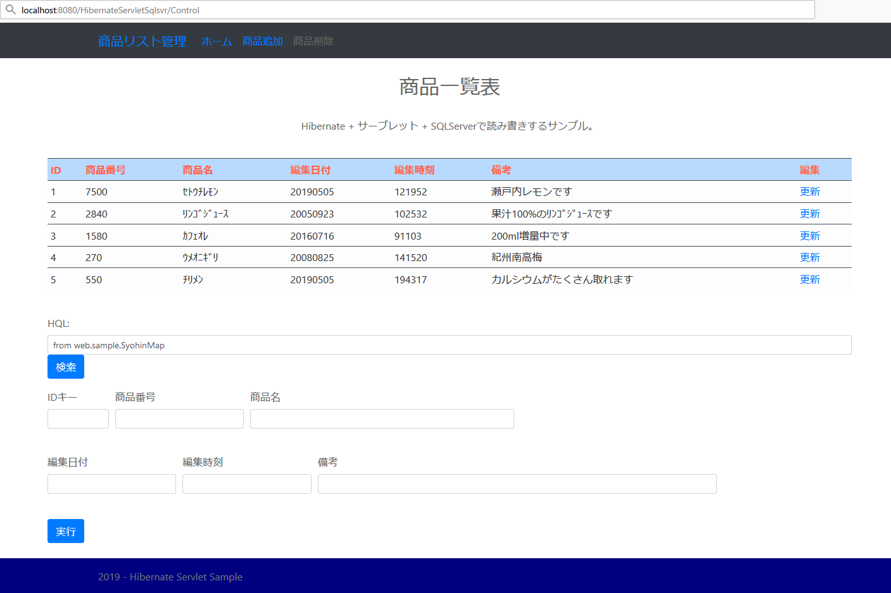

## :octocat: サーブレットでHibernateを使いSQLServerとの読み書きサンプル
___
### 環境
```
開発環境：Eclipse 2020-03 R(4.15.0) Pleiades
言語：Java 11
デベロッパーSDK：Adopt OpenJDK 11.0.5
サーブレットコンテナ：Apache Tomcat 9.0.33
テンプレートエンジン：なし（JSP）
データベース：Microsoft SQLServer 2019 Express CU3  
-データベース管理ツール：Microsoft SQL Server Management Studio 18.4  
データベース接続：Microsoft JDBC Driver 8.2.2 for SQL Server  
O/R マッパー フレームワーク：Hibernate ORM 5.4.12 Final
CSSテンプレート：Bootstrap 4.4.1
```

